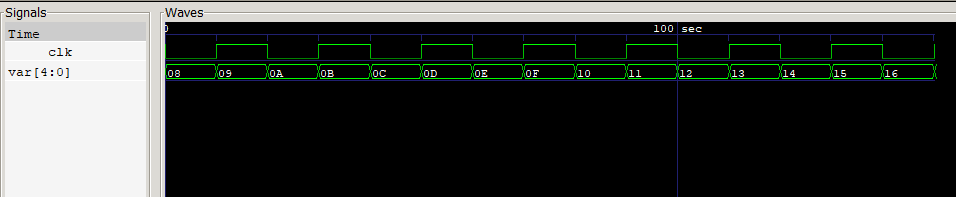

# Output & Graph:

Hello Verilog World!!  
Binary value of var is: 01000  
VCD info: dumpfile system_tasks.vcd opened for output. 
                   0 Clk value is: 0 -- var value is: 01000 
                  10 Clk value is: 1 -- var value is: 01001 
                  20 Clk value is: 0 -- var value is: 01010 
                  30 Clk value is: 1 -- var value is: 01011 
                  40 Clk value is: 0 -- var value is: 01100 
.\system_tasks.v:31: $stop called at 50 (1s) 
** VVP Stop(0) ** 
** Flushing output streams. 
** Current simulation time is 50 ticks. 
> cont 
** Continue ** 
                  50 Clk value is: 1 -- var value is: 01101 
                  60 Clk value is: 0 -- var value is: 01110 
                  70 Clk value is: 1 -- var value is: 01111 
                  80 Clk value is: 0 -- var value is: 10000 
                  90 Clk value is: 1 -- var value is: 10001 
                 100 Clk value is: 0 -- var value is: 10010 
                 110 Clk value is: 1 -- var value is: 10011 
                 120 Clk value is: 0 -- var value is: 10100 
                 130 Clk value is: 1 -- var value is: 10101 
                 140 Clk value is: 0 -- var value is: 10110 
.\system_tasks.v:32: $finish called at 150 (1s) 
                 150 Clk value is: 1 -- var value is: 10111 