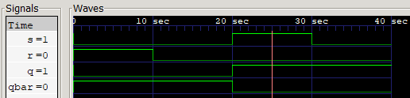

## SR Latch (NAND-Based)
This project implements a basic SR Latch using NAND gates in Verilog. 
The SR (Set-Reset) latch is one of the most fundamental sequential circuits, used to store a single bit of data. This implementation focuses on using active-low inputs (Sbar and Rbar) to demonstrate the bistable nature of the circuit.
### Logic and Truth Table
The latch is constructed using two cross-coupled NAND gates. In an active-low configuration, the set and reset actions occur when the respective input is driven to logic 0.
``` Truth Table (NAND SR Latch – Active Low)
S̅	R̅	 Q 	  Operation
0	1	1		Set
1	0	0		Reset
1	1	Hold	No Change
0	0	Invalid	Forbidden
```
### Implementation Details
The design is modeled at the gate level to represent the physical cross-coupling of the gates.
```Design code:
module sr_latch(Sbar, Rbar, Q, Qbar);
    input Sbar, Rbar;
    output Q, Qbar;

    nand n1(Q, Sbar, Qbar);
    nand n2(Qbar, Rbar, Q);
endmodule
```
### Verification and Simulation
To verify the design, the circuit was simulated using Icarus Verilog and visualized through GTKWave. The testbench was designed to exercise all valid states, specifically focusing on the memory (Hold) capability after both Set and Reset operations.
### Simulation Output (Console Output)
```
                   0 -- Sbar = 0 -- Rbar = 1 -- Q = 1 -- Qbar = 0 //set
                  10 -- Sbar = 1 -- Rbar = 1 -- Q = 1 -- Qbar = 0 //hold after set
                  20 -- Sbar = 1 -- Rbar = 0 -- Q = 0 -- Qbar = 1 //reset
                  30 -- Sbar = 1 -- Rbar = 1 -- Q = 0 -- Qbar = 1 //hold after reset
                  
```
### Waveform


### Future Improvements
```
-Add a NOR-based SR latch for comparative analysis of active-high vs active-low logic.
-Advance the design to a clocked SR Flip-Flop to study synchronous behavior.
-Utilize the SR latch as a building block for a D-type Flip-Flop.
```