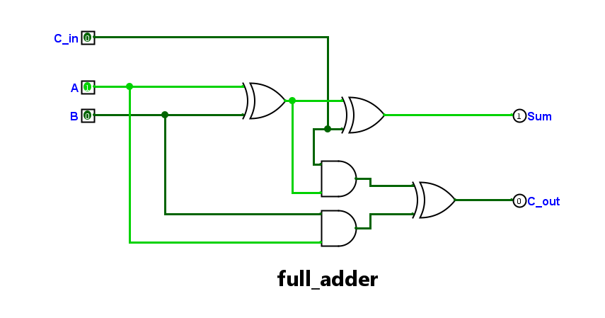
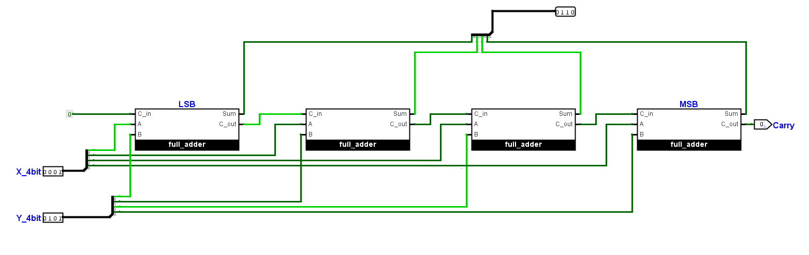
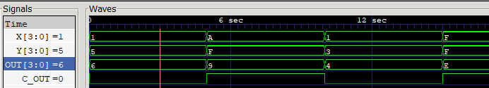

## 4-Bit Ripple Carry Adder
A Verilog implementation of a 4-bit Ripple Carry Adder (RCA) using gate-level modeling. 
The design is built structurally by cascading four 1-bit Full Adders.

### Architecture
The design consists of four 1-bit Full Adders connected in cascade. 
The carry output from each stage propagates to the carry input of the next stage, forming a Ripple Carry Adder architecture.




---

### Simulation Output:
```
4-bit Full Adder: 

 0 --- Input: [X = 0001 | Y = 0101] 
Output: [ Sum = 0110 | Carry = 0 ]

 5 --- Input: [X = 1010 | Y = 1111] 
Output: [ Sum = 1001 | Carry = 1 ]

10 --- Input: [X = 0001 | Y = 0011] 
Output: [ Sum = 0100 | Carry = 0 ]

15 --- Input: [X = 1111 | Y = 1111] 
Output: [ Sum = 1110 | Carry = 1 ]
```
### Simulation Waveform


### Tools Used:
- Simulator: Icarus Verilog

- Waveform Viewer: GTKWave

- Ciruit Design: Logisim


### Future
- Automated verification using a self-checking testbench
- Implement Dataflow Modeling version
- Implement Behavioral Modeling version
- Compare different abstraction styles