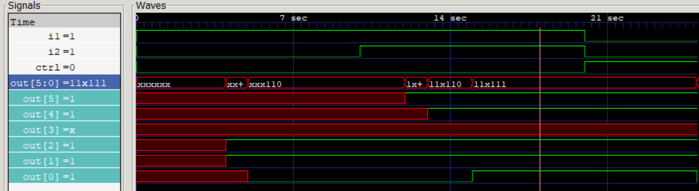
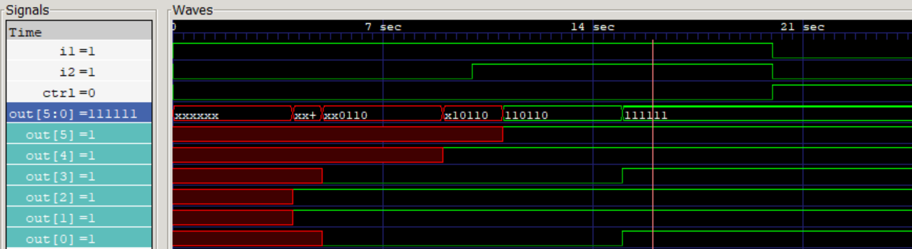
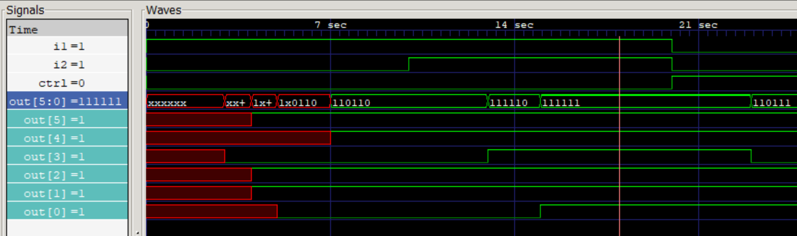

# Gate Level Delays in Verilog

This project explores the implementation and simulation of various gate delays using Verilog. It specifically focuses on rise, fall, and turn-off delays, as well as the application of **min:typ:max** delay specifications.

## Overview

In digital design, hardware gates do not react instantaneously. Verilog allows us to model these physical characteristics using delay specifications. This repository demonstrates how different configurations affect the timing of the output waveforms.

### Types of Delays Explored:

1. **Rise Delay:** The time taken for an output to transition to 1.
2. **Fall Delay:** The time taken for an output to transition to 0.
3. **Turn-off Delay:** The time taken for an output to transition to high impedance (z).

## Implementation

The module `delays.v` implements various gates with different delay formats:

* **Single Delay:** `and #(5)` (Same delay for rise, fall, and turn-off).
* **Two Delays:** `or #(4,6)` (Rise=4, Fall=6).
* **Three Delays:** `bufif0 #(4,6,7)` (Rise=4, Fall=6, Turn-off=7).
* **Min:Typ:Max:** Represented as `#(min:typ:max)`.

### Verilog Code

```verilog
module delays(
    output [5:0]out,
    input i1, i2, ctrl
);

// Standard Gate Delays
and #(5) (out[0], i1, i2);
or #(4,6) (out[1], i1, i2);
bufif0 #(4,6,7) (out[2], i1, ctrl);

// Min:Typ:Max Delays
and #(3:5:11) (out[3], i1, i2);
or #(7:9:13, 5:10:13) (out[4], i1, i2);
bufif0 #(4:11:12, 9:11:15, 5:6:8) (out[5], i1, ctrl);

endmodule

```

## Simulation Results

To observe the different timing behaviors, the simulation was executed using `iverilog` with specific timing flags.

### 1. Maximum Delays (`-Tmax`)

The simulator uses the largest value in the `min:typ:max` triplet. This represents the worst-case scenario.

**Execution:**
`iverilog -Tmax -o gate_delays.vvp gate_delays.v tb_gate_delays.v`



---

### 2. Typical Delays (`-Ttyp`)

The simulator uses the middle value. This is the default behavior in most Verilog simulators and represents expected hardware performance.

**Execution:**
`iverilog -Ttyp -o gate_delays.vvp gate_delays.v tb_gate_delays.v`



---

### 3. Minimum Delays (`-Tmin`)

The simulator uses the smallest value, representing the best-case timing scenario (fastest silicon).

**Execution:**
`iverilog -Tmin -o gate_delays.vvp gate_delays.v tb_gate_delays.v`



## Conclusion

By comparing the three waveforms, we can see how the output transitions shift in time. For instance, in `out[3]`, the transition occurs at **3 units** for Min, **5 units** for Typ, and **11 units** for Max. This exercise is crucial for understanding setup and hold time analysis in core electronics.

---

### Tools Used:

* **Simulator:** Icarus Verilog
* **Viewer:** GTKWave
* **Reference:** *Verilog HDL* by Samir Palnitkar