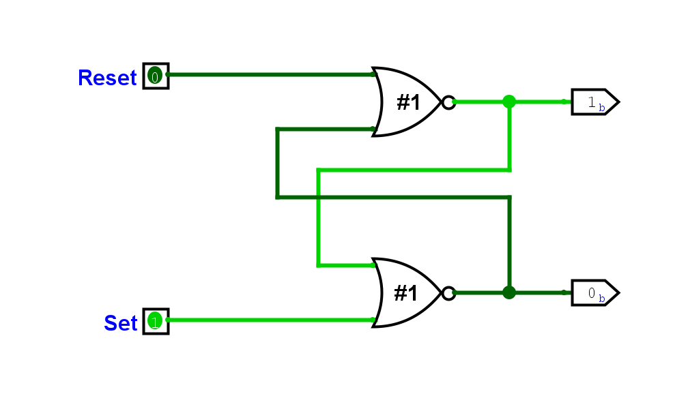
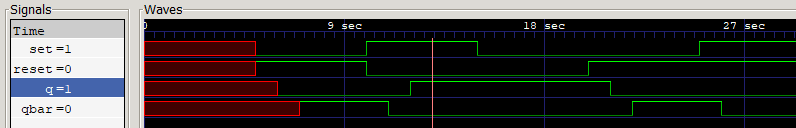

### Circuit Diagram:




### Simulation Output:

```
 0 -- Set = x | Reset = x || Q = x | Qbar = x
 5 -- Set = 0 | Reset = 1 || Q = x | Qbar = x
 6 -- Set = 0 | Reset = 1 || Q = 0 | Qbar = x
 7 -- Set = 0 | Reset = 1 || Q = 0 | Qbar = 1
10 -- Set = 1 | Reset = 0 || Q = 0 | Qbar = 1
11 -- Set = 1 | Reset = 0 || Q = 0 | Qbar = 0
12 -- Set = 1 | Reset = 0 || Q = 1 | Qbar = 0
15 -- Set = 0 | Reset = 0 || Q = 1 | Qbar = 0
20 -- Set = 0 | Reset = 1 || Q = 1 | Qbar = 0
21 -- Set = 0 | Reset = 1 || Q = 0 | Qbar = 0
22 -- Set = 0 | Reset = 1 || Q = 0 | Qbar = 1
25 -- Set = 1 | Reset = 1 || Q = 0 | Qbar = 1
26 -- Set = 1 | Reset = 1 || Q = 0 | Qbar = 0
```

### Simulation Waveform:
