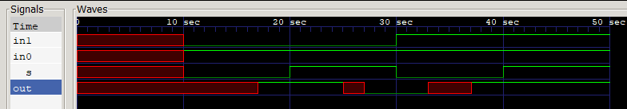
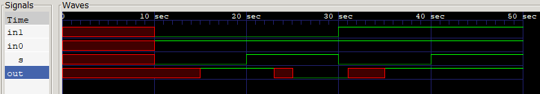

# Maximum Delay (T-max):

### Simulation Output:
```
 0 -- in1 = x | in0 = x | s = x || OUT = x
10 -- in1 = 0 | in0 = 1 | s = 0 || OUT = x
17 -- in1 = 0 | in0 = 1 | s = 0 || OUT = 1
20 -- in1 = 0 | in0 = 1 | s = 1 || OUT = 1
25 -- in1 = 0 | in0 = 1 | s = 1 || OUT = x
27 -- in1 = 0 | in0 = 1 | s = 1 || OUT = 0
30 -- in1 = 1 | in0 = 1 | s = 0 || OUT = 0
33 -- in1 = 1 | in0 = 1 | s = 0 || OUT = x
37 -- in1 = 1 | in0 = 1 | s = 0 || OUT = 1
40 -- in1 = 1 | in0 = 1 | s = 1 || OUT = 1
```

### Waveform:

---

# Typical Delay (T-typ):

### Simulation Output:
```
 0 -- in1 = x | in0 = x | s = x || OUT = x
10 -- in1 = 0 | in0 = 1 | s = 0 || OUT = x
16 -- in1 = 0 | in0 = 1 | s = 0 || OUT = 1
20 -- in1 = 0 | in0 = 1 | s = 1 || OUT = 1
24 -- in1 = 0 | in0 = 1 | s = 1 || OUT = x
26 -- in1 = 0 | in0 = 1 | s = 1 || OUT = 0
30 -- in1 = 1 | in0 = 1 | s = 0 || OUT = 0
32 -- in1 = 1 | in0 = 1 | s = 0 || OUT = x
36 -- in1 = 1 | in0 = 1 | s = 0 || OUT = 1
40 -- in1 = 1 | in0 = 1 | s = 1 || OUT = 1
```

### Waveform:


---


# Minimum Delay (T-min):

### Simulation Output:
```
 0 -- in1 = x | in0 = x | s = x || OUT = x
10 -- in1 = 0 | in0 = 1 | s = 0 || OUT = x
15 -- in1 = 0 | in0 = 1 | s = 0 || OUT = 1
20 -- in1 = 0 | in0 = 1 | s = 1 || OUT = 1
23 -- in1 = 0 | in0 = 1 | s = 1 || OUT = x
25 -- in1 = 0 | in0 = 1 | s = 1 || OUT = 0
30 -- in1 = 1 | in0 = 1 | s = 0 || OUT = 0
31 -- in1 = 1 | in0 = 1 | s = 0 || OUT = x
35 -- in1 = 1 | in0 = 1 | s = 0 || OUT = 1
40 -- in1 = 1 | in0 = 1 | s = 1 || OUT = 1
```

### Waveform:


---
---

## Analysis of Signal Contention (Intermediate 'x') - For Typical Delay

The `x` states appear because the **Turn-off delay (6)** is longer than the **Rise (2)** or **Fall (4)** delays. This creates a "contention window" where both buffers are driving the wire at the same time.

### Timing Breakdown

* **$s: 0 \to 1$ (at $t=20$):** `bufif0` stays active until $t=26$, but `bufif1` starts driving at $t=24$.
* **Contention:** $t \in [24, 26]$


* **$s: 1 \to 0$ (at $t=30$):** `bufif1` stays active until $t=36$, but `bufif0` starts driving at $t=32$.
* **Contention:** $t \in [32, 36]$


### Solution

In hardware design, this is avoided using **Break-Before-Make** logic—ensuring the turn-off delay is shorter than the turn-on delay so the wire is released before the next driver takes over.
