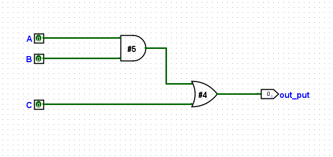
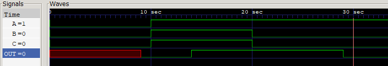

# Logic Gate Delay and Path Latency Analysis

This project explores the implementation of gate-level delays in Verilog. By assigning specific time units to gates, we can observe how signals propagate through different physical paths and how those delays impact the final output timing.

---

### Circuit Logic

The circuit implements a combinational logic function using an AND gate and an OR gate. Based on the implementation, the logical expression is:

$$out = (a \cdot b) + c$$

The provided schematic confirms that inputs A and B are processed by the AND gate first, while input C enters the circuit at the final OR stage.

---

### Delay Path Analysis

The total propagation delay from an input to the output depends on the specific path the signal takes.

1. Path A/B to Output:
Signals from A or B must pass through both the AND gate and the OR gate.
Total delay = 5 (AND) + 4 (OR) = 9 units.
2. Path C to Output:
The signal from C only passes through the OR gate.
Total delay = 4 units.

---

### Verilog Implementation

The module uses gate-level primitives with delay specifications to model hardware behavior.

```verilog
module example(
    output out,
    input a, b, c 
);
wire e;

// AND gate with a 5-unit inertial delay
and #5 (e, a, b);

// OR gate with a 4-unit inertial delay
or #4 (out, e, c);

endmodule

```

---

### Schematic Diagram
The image below shows the gate connections and the individual delay values assigned to each component.

### Timing Waveform
The waveform highlights the transitions of A, B, C, and the resulting delay in the OUT signal.

---

### Conclusion

This exercise demonstrates that the speed of a digital circuit is determined by its longest path (critical path). Even if one input changes quickly, the output may be "held" by a slower path in the logic.

---

In your testbench, I noticed a small case-sensitivity detail: you declared the wire as `out` but used `OUT` in the `monitor` and the `uut` instantiation. In Verilog, these are treated as different names, so you might want to ensure they match for consistency!

Since you are looking at these path delays, are you planning to explore how "glitches" or "hazards" occur when two paths have different delays?