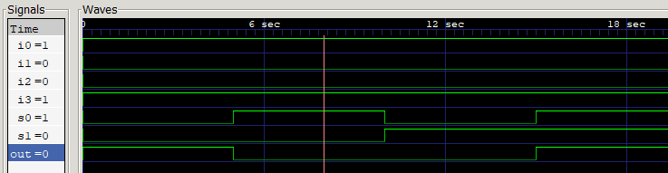

# 4:1 Multiplexer (Gate-Level Modeling)

This project implements a 4:1 Multiplexer in Verilog using Gate-Level Modeling.

The design is constructed using primitive logic gates such as:
- AND
- OR
- NOT

The objective of this implementation is to understand how combinational circuits can be built from basic logic gates and how select lines control data propagation in a multiplexer.

Future implementations of the same design will also explore:
- Dataflow Modeling
- Behavioral Modeling

---

## Truth Table

---

## Circuit Design

---

## Waveform

---
## Key Learning

- Understanding gate-level construction of multiplexers
- Select line decoding using inverted signals
- Structural realization of combinational logic
- Importance of signal routing and logic simplification

---

## Future Improvements

- Implement Dataflow Modeling version
- Implement Behavioral Modeling version
- Add simulation waveform screenshots
- Compare different abstraction styles
- Analyze readability and scalability of each approach