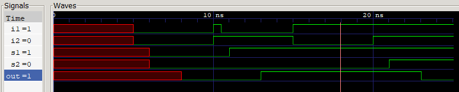

# Delay in Contious Assignment:
- The time it takes for a newly evaluated right-hand side (RHS) value to update the left-hand side (LHS) net.
- **Inertial Delay**: A property where any input pulse shorter than the specified delay is not propagated to the output. If a value changes and then reverts within the delay window, the output remains unmodified (i.e., the brief change is ignored).

### Verilog Implementation:
```verilog
//Regular Assignment Delay
assign #2 out = s1 ^ s2; //xor


//Implicit Continous Assignment Delay
wire #1 s1 = i1 | i2;

//Net Declaration Delay -- Any operation when done on s2 -- will have a delay of given value
// wire #5 s2; --> Not supported in this version
wire s2;
assign #1 s2 = i1 & i2;
```

### Simulation Output:
```
  0 -- [i1 = x | i2 = x] -- OUTPUT = x 
 50 -- [i1 = 0 | i2 = 0] -- OUTPUT = x 
 80 -- [i1 = 0 | i2 = 0] -- OUTPUT = 0 
100 -- [i1 = 1 | i2 = 1] -- OUTPUT = 0 
105 -- [i1 = 0 | i2 = 1] -- OUTPUT = 0 
130 -- [i1 = 0 | i2 = 1] -- OUTPUT = 1 
150 -- [i1 = 1 | i2 = 0] -- OUTPUT = 1 
200 -- [i1 = 1 | i2 = 1] -- OUTPUT = 1 
230 -- [i1 = 1 | i2 = 1] -- OUTPUT = 0 
```

### Waveform:

