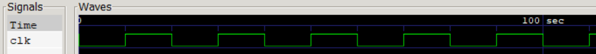

# Structured Procedures (Using Clock Generator):
    Always Block
    Initial Block
- If there are multiple blocks each start execution concurrently at time 0.
- Always & Initial cannot be nested


### Verilog Implementation:
```
initial
    clk = 1'b0;

always
    #10 clk = ~clk;

initial begin
    $dumpfile("tb_clk_generator.vcd");
    $dumpvars(0,clock_gen);

    #1000 $finish;
end
```

### Waveform:
