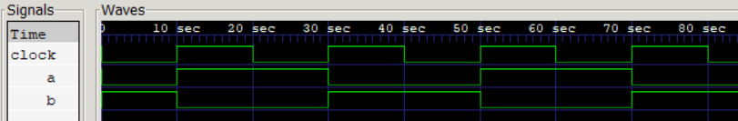

# Procedural Assignments:

    Blocking ("=")
    Non-Blocking ("<=")

- These update the values of reg, integer, real or time (their bit-select or part-select or concatenation)
- Unlike continuous assignment, the variable value wont change until next procedural assignment.
- Gemini: **The Golden Rule of Verilog:** > * Always use **non-blocking assignments (`<=`)** for sequential logic (`always @(posedge...)`).

### Blocking Assignment:
- In sequential block they are executed in specified order
- In parallel block it does not block the execution of statements that follow

### Non-Blocking Assignment:
- It doesn't blocks the execution of statements that follow in sequential block
- "<="  Operator is used for non-blocking assignment
- Typically, non blocking assignment statements are executed last in the time step in which they are scheduled, i.e., after all the blocking assignments in that time step are executed.
- (Application): They are used as a method to model several concurrent data transfers that take place after a common event.  (Blocking Assignment can cause **RACE CONDITION**)
- __Imp__ : How it Executes: It evaluates all RHS values immediately at the clock edge, but waits until the **end of the time step** to update the left-hand side LHS variables.
- **Hardware Equivalent:** It synthesizes into sequential logic (Flip-Flops and Registers) because it perfectly mimics physical hardware timing.
- They are also used to avoid race-condition
- Application: Pipeline Modelling
- Downside: Increase memory usage and degradation in simulator performance

### Verilog Implementation:
```
always @(posedge clock) begin
    a <= b;
end
always @(posedge clock) begin
    b <= a;
end
```

### Waveform:
