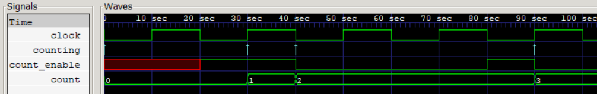

# Named Event Control:

### Verilog Implementation:
```
event counting;

always @(clock) begin
    if(count_enable)
        -> counting;
end

always @(counting) begin
    count <= count + 1;
end

initial begin
    count_enable <= #20 1; 
    count_enable <= #40 0;
    count_enable <= #80 1;
    count_enable <= #90 0;
end
```

### Simulation Output:
```
 0 -- count_enable = x | count =           0 
20 -- count_enable = 1 | count =           0 
30 -- count_enable = 1 | count =           1 
40 -- count_enable = 0 | count =           2 
80 -- count_enable = 1 | count =           2 
90 -- count_enable = 0 | count =           3
```

### Waveform:
