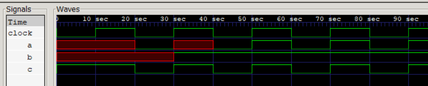

# Regular Event Control:

### Verilog Implementation:
```
always @(clock) c = 1;

always @(posedge clock) a = b; 

always @(negedge clock) begin
    c = 0; a = 0;
end

always b = @(posedge clock) c; //c is evaluated immediately and assigned at posedge of clock.

```

### Simulation Output:
```
 0 -- a = x | b = x | c = 1 | 
20 -- a = 0 | b = x | c = 0 | 
30 -- a = x | b = 1 | c = 1 | 
40 -- a = 0 | b = 1 | c = 0 | 
50 -- a = 1 | b = 1 | c = 1 | 
60 -- a = 0 | b = 1 | c = 0 | 
70 -- a = 1 | b = 1 | c = 1 | 
80 -- a = 0 | b = 1 | c = 0 | 
90 -- a = 1 | b = 1 | c = 1 | 
100 -- a = 0 | b = 1 | c = 0 | 
```

### Waveform:
