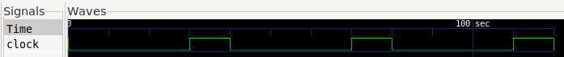

### Problem Statement:
- Design a clock with time period = 40 and a duty cycle of 25% by using initial and always statements.
- Clock should be initialized with 0 at t = 0.


### Verilog Implementation:
```
reg clock ;

initial begin
    clock = 0;

    $dumpfile("tb_src.vcd");
    $dumpvars(0,main);


    repeat(3) @(negedge clock); $finish;
end

always begin
    #30 clock = ~clock;
    #10 clock = ~clock;
end

```

### Simulation Waveform:
